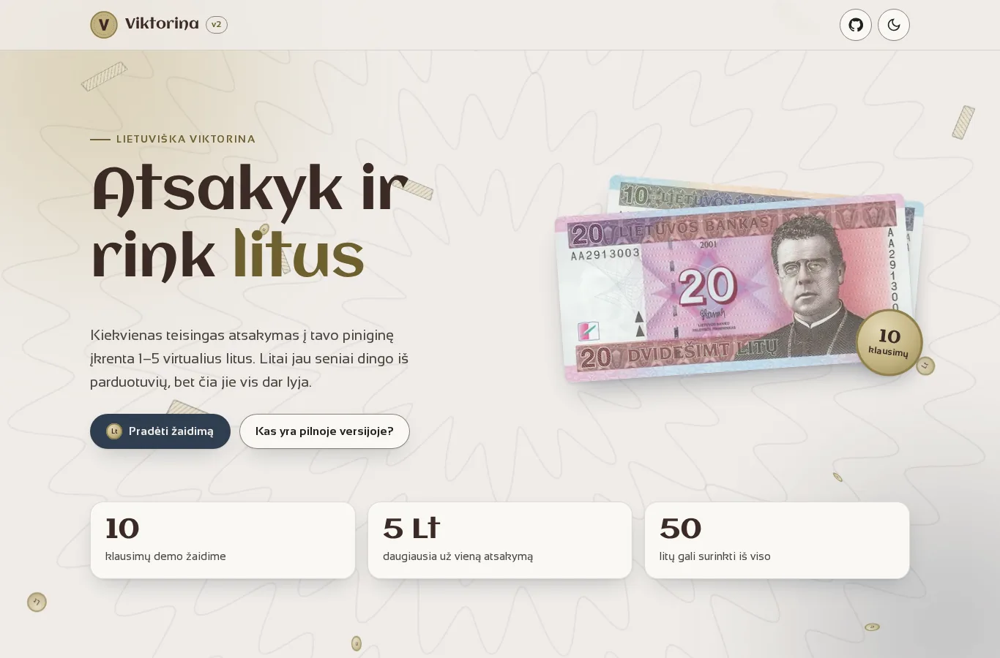
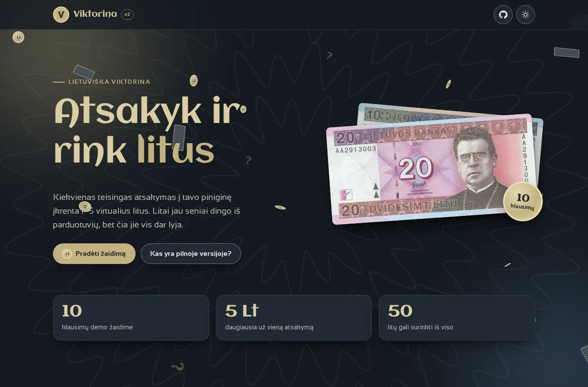
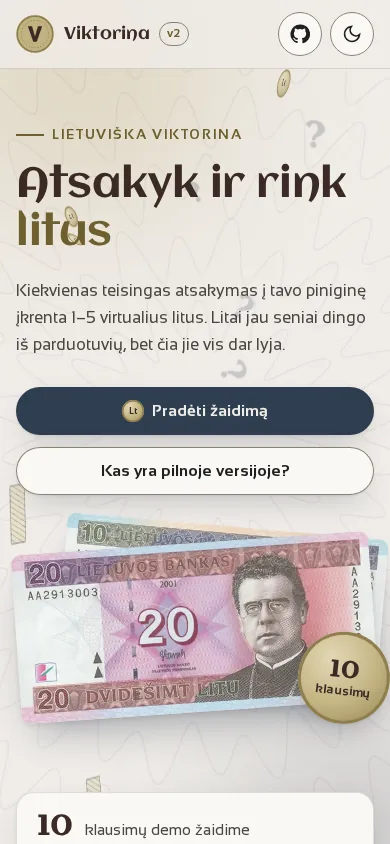

# Viktorina v2

A Lithuanian quiz game where every correct answer drops virtual **litai** (the pre-euro Lithuanian currency) into your wallet.

**[▶ Live demo](https://brutall100.github.io/viktorina-v2/)** · **[Source code](https://github.com/brutall100/viktorina-v2)**



| Dark theme | Phone (390 px) |
| --- | --- |
|  |  |

## About

Viktorina started as a live multiplayer quiz: the server posts a new question for everyone at the same time, the first player to type the right answer earns litai, and players chat, vote on each other's questions and climb the TOP 10.

The project has two parts:

- **Demo (GitHub Pages)**: the root `index.html`. A 10-question quiz that runs fully in the browser, with no server or database.
- **Full version**: the `app/` folder. PHP pages, seven Node.js servers and a MySQL database. It runs locally (XAMPP or similar).

## Features

**Demo**
- 10 multiple-choice questions in random order. Each is worth a random 1–5 Lt, shown with a real litas banknote.
- Wallet with flying-coin animation, progress bar, final score and "play again".
- **Live background, "Litų lietus" (rain of litai)**: falling banknotes, spinning "Lt" coins and floating question marks over a slowly turning guilloche rosette (the engraved pattern on banknotes).
- Light and dark theme that follows the system, with a toggle that remembers your choice and never flashes on load.
- Accessible: skip link, visible focus, live regions for feedback, `prefers-reduced-motion` support. Works at 390 px with no sideways scroll.

**Full version (`app/`)**
- Registration, login, email confirmation and password reset (bcrypt, Nodemailer).
- Live quiz rounds, bonus litai, old-question history.
- Chat, question submission and voting, error reports, idea box.
- Daily / weekly / monthly TOP, player levels and three mini-games.

## Built with

- HTML, CSS (custom properties, no framework), vanilla JavaScript: demo
- PHP 8, Node.js (Express, EJS, mysql2, node-cron, Nodemailer, bcrypt), MySQL, Bootstrap 5: full version

**Colour palette** (all colours live in `:root` in [`css/style.css`](css/style.css))

| Colour | Hex | Used for |
| --- | --- | --- |
| Navy | `#2f3e4f` | Primary buttons (light), dark-theme surfaces, focus ring |
| Sand | `#c2b280` | Coins, glow, primary buttons (dark), accent text in dark |
| Sand ink | `#6e5f2e` | Accent **text** in light theme (sand darkened for 5.9 : 1 contrast) |
| Espresso | `#3b2a24` | Headings, logo letter |
| Paper | `#f0ece8` | Light background, text on navy |
| Ink | `#1f1f1f` | Body text, text on sand |

All text meets WCAG AA (4.5 : 1 or more). Body text is 14 : 1 in light and 15 : 1 in dark.

**Fonts:** [Aclonica](https://fonts.google.com/specimen/Aclonica) for headings and [Sansation](https://fonts.google.com/specimen/Sansation) for text (Google Fonts).

## What I learned

- Splitting one app into PHP pages and several small Node.js servers, and how much harder that makes deployment.
- Why SQL must use prepared statements, why passwords must be hashed and never kept in the session, and why secrets belong in `.env`, not in code.
- Building a lively background that stays light: animating only `transform` and `opacity`, fewer particles on phones, and turning motion off for `prefers-reduced-motion`.
- Designing themes with CSS custom properties and checking contrast with numbers, not by eye.

## Run it locally

### Demo (no server)

```bash
git clone https://github.com/brutall100/viktorina-v2.git
cd viktorina-v2
python3 -m http.server 8000   # or open index.html directly
```

Then open http://localhost:8000.

### Full version (PHP + Node.js + MySQL)

1. Put the project in your web root so it opens at `http://localhost/viktorina-v2/` (for XAMPP: `htdocs/viktorina-v2`).
2. Create a MySQL database named `viktorina`. The database schema (tables `super_users`, `main_database`, `question_answer`, `old_qna`, `chat_app_db`, `x_vote*` …) is **not included** in this repository.
3. Create the settings file and fill it in:
   ```bash
   cp app/.env.example app/.env
   ```
   Fill in `DB_*` (database login), `MAIL_*` (a Gmail address and app password for the emails) and `APP_URL` if your address is different. Leave the ports as they are unless they are busy.
4. Start the Node servers:
   ```bash
   cd app/server
   npm install
   npm start          # starts all servers (ports 4000–4006)
   ```
5. Open `http://localhost/viktorina-v2/app/login.php`.

> The real `app/.env` is ignored by git and blocked from the web by `app/.htaccess`.

## Project structure

```
viktorina-v2/
├── index.html            # demo page (GitHub Pages)
├── css/style.css         # palette + all demo styles
├── js/
│   ├── theme-init.js     # applies saved theme before paint
│   ├── background.js     # "Litų lietus" live background
│   ├── questions.js      # demo questions
│   ├── quiz.js           # demo game logic
│   └── main.js           # theme toggle, ripple, reveal, count-up
├── images/
│   ├── litai/            # banknote images (WebP)
│   ├── icons/            # logos and small icons
│   └── backgrounds/      # backgrounds for the full version
├── docs/                 # README screenshots
├── app/                  # full version
│   ├── *.php, *.js, *.css  # quiz, login, question voting …
│   ├── header/ footer/ games/ statistics/ info/
│   ├── server/           # Node.js servers + EJS views
│   ├── config-db.php     # reads DB settings from app/.env
│   └── .env.example
├── favicon.svg
└── LICENSE
```

## Credits

- Litas banknote images: Bank of Lithuania (Lietuvos bankas), historical banknotes used for illustration.
- Background images of the full version come from the original project: some were generated with DALL·E, and a hexagon background is by [coolvector on Freepik](https://www.freepik.com/free-vector/dark-hexagonal-background-with-gradient-color_12804207.htm).
- Fonts: Aclonica (Astigmatic) and Sansation (Bernd Montag), both under the SIL Open Font License, via Google Fonts.
- Bootstrap 5 (MIT) in the full version.

## License

[MIT](LICENSE) © 2024 brutall100
